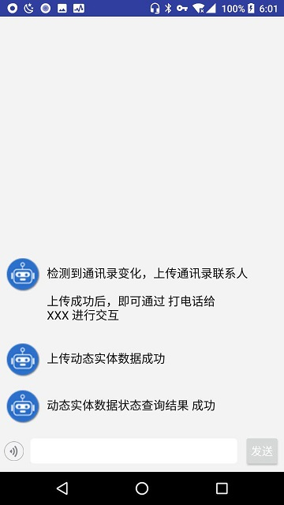
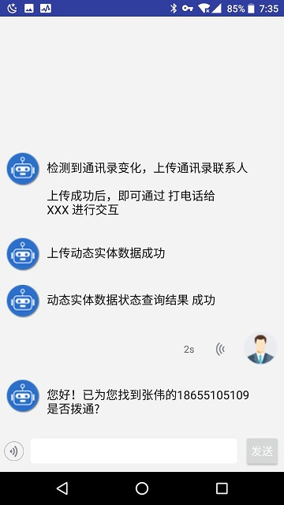

# AIUI 个性化（动态实体）Demo

## 1. 动态实体介绍

AIUI动态实体的概念参见[AIUI动态实体](http://aiui.xfyun.cn/jupiter-platform/help/devDoc#5-3-2)。

## 2. 动态实体使用

AIUI动态实体使用参见[AIUI动态实体使用](http://aiui.xfyun.cn/jupiter-platform/help/devDoc#2-10)。

## 3. Demo介绍

Demo演示了用户级和自定义两种维度的实体。

### 3.1 电话技能演示

用户级实体通过打电话的技能进行演示，通过上传手机联系人到内置动态实体``IFLYTEK.telephone_contact``

    List<String> contacts = mContactRepository.getContacts();
    for (String contact : contacts) {
        String[] nameNumber = contact.split("\\$\\$");
        contactJson.append(String.format("{\"name\": \"%s\", \"phoneNumber\": \"%s\" }\n",
                nameNumber[0], nameNumber[1]));
    }

    syncDynamicData(new DynamicEntityData(
            "IFLYTEK.telephone_contact", "uid", "", contactJson.toString()));

上传成功后，通过 ``打电话给xxx``(xxx为手机联系人）就会识别正确的联系人名字并且返回包含联系人信息的电话语义结果。

使用示例如下：

### 3.2 点菜技能演示

自定义维度实体通过点菜技能演示。点菜技能定义如下:

其中菜名对应的``menuItem``实体为动态实体，定义如下:

Demo中通过如下代码，上传``menuItem``对应的动态实体数据

    String[] menuItemsStr = menuSrcData.split("\r?\n");
    StringBuffer menuItemData = new StringBuffer();
    for(String item : menuItemsStr){
        menuItemData.append(String.format("{\"name\": \"%s\"}\n", item));
    }

    MessagesViewModel.getInstance().syncDynamicData(new DynamicEntityData(
            "FOOBAR.menuRes", "branch", url, menuItemData.toString()
    ));

使用示例如下：

