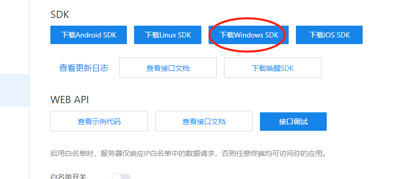
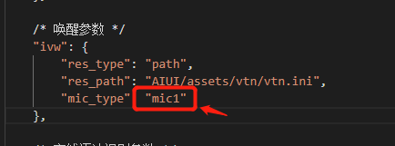
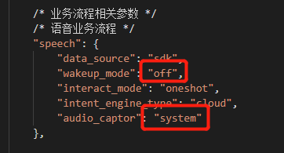
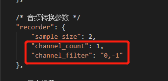
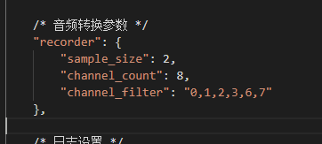

AIUI接VTN多麦降噪引擎
#############################

1.	登录 https://aiui.xfyun.cn/ 平台，下载相应平台的sdk，此功能在 5.6.1069.1001 版本以上，之前版本的需重新下载sdk版本，以Windows为例

 
2.	文件结构如下

.. code-block:: bash

    ├── include
    ├── libs
    │   ├── x64
    │   └── x86
    ├── README.md
    └── samples
    ├── AIUI
        ├── aiui_sample
    ├── samples.sln

3.	修改 AIUI内配置参数 路径为：samples\AIUI\cfg\aiui.cfg	（以线性4麦为参考）
1.	修改mic_type为mic4

 
2.	修改wakeup_mode为 vtn，audio_captor为portaudio

 
3.	修改channel_count和channel_filter （鱼亮科技提供的usb录音板为参考）
 

改为以下

4.	将提供的库 vtn_mic4.dll （以线性4麦为参考）放置与aiui.dll同级
