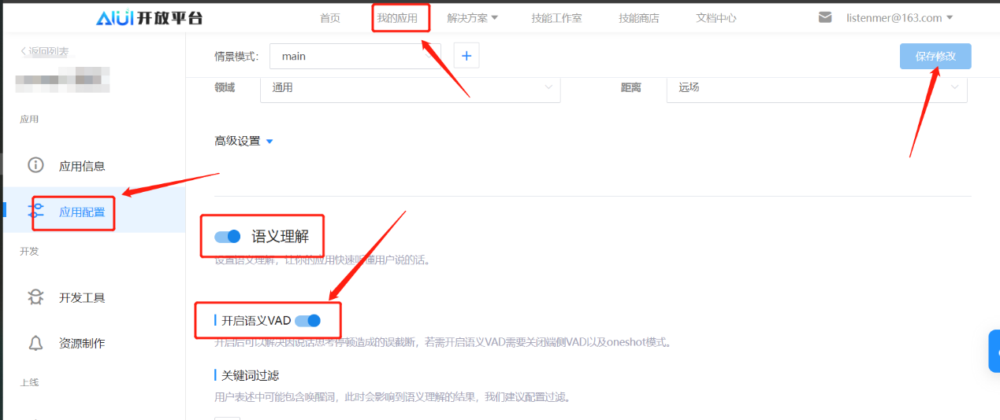
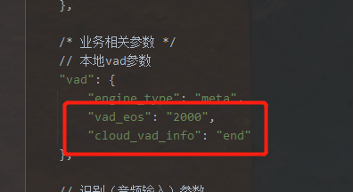

开启语义VAD
#############################

1. 平台设置
=============================

 1.1. 在 aiui.xfyun.cn 平台 **我的应用** → **应用配置** → **语义理解** → **开启语义VAD**

1.2	点击保存。(语义VAD 开启需要一定的时间，接下端上的操作请等候一两分钟)。

2. 端侧设置
=============================

2.1 在端上的SDK配置文件 aiui.cfg 中的vad 配置段添加一下内容

 - vad_eos 这是本地的VAD后端点时长， 默认云端是 1.8s，所以本地可以设置为2s
 - cloud_vad_info 接收云端VAD尾端点的配置

2.2	最终如下图所示：

2.3	不用做其他处理，正常交互即可。