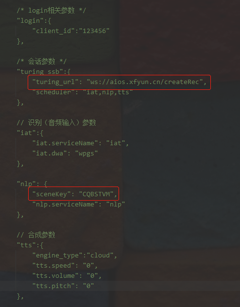

私有化Turing 接入指南
#############################

1.    简要说明，为了更好支持开发者快速的从AIUI公有云切换到私有化Turing。SDK内部做了大量的转换。私有化Turing的调用方式，接口等都与公有云AIUI保持一致。以下仅对不同的地方做下解释。
2.    配置变化（仅Turing使用，红色字段为必填，其他可选）

1. 新增 turing_ssb 字段

==========  ============================  ========================
  字段名                取值                        备注
==========  ============================  ========================
turing_url  ws://xxxxxxxxxxxxx/createRec  私有化部署地址
----------  ----------------------------  ------------------------
scheduler   iat,nlp,tts                   需要调用的能力，默认为空
==========  ============================  ========================

2.  login 字段 

=========  ====  ======
 字段名    取值   备注
=========  ====  ======
client_id  ""    设备id
=========  ====  ======

3. iat 字段 

===============  ====  ======================================
    字段名       取值                   备注
===============  ====  ======================================
iat.serviceName  iat   默认为空，若有方言需求，可能为iat_en等
---------------  ----  --------------------------------------
iat.dwa          pgs   是否开启流式识别
---------------  ----  --------------------------------------
iat.hotword      ""    会话级热词
===============  ====  ======================================

4. nlp 字段 

===============  =========  ================
    字段名         取值           备注
===============  =========  ================
sceneKey         xxxxxxxxx  云端语义的场景名
---------------  ---------  ----------------
nlp.serviceName  nlp        默认为空
===============  =========  ================

5. tts 字段 

====================  ====  ========
       字段名         取值    备注
====================  ====  ========
tts.speed             0     -500~500
--------------------  ----  --------
tts.volume            0     -20~20
--------------------  ----  --------
ts.native_voice_name  ""    发言人
====================  ====  ========

具体如下图，

6. 结果解析（具体从接收到的数据）

