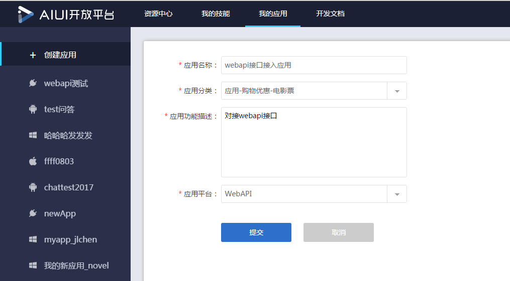
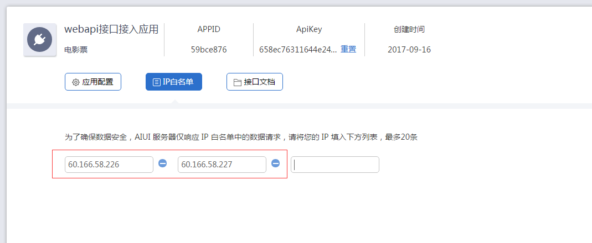
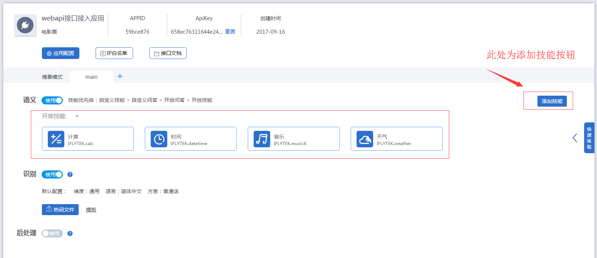

# webapi接口接入文档V1.0
## 1、简介
* 本文档旨在帮助开发者快速接入webapi接口

## 2、接入步骤
### 2.1、	aiui开放平台创建webapi应用


### 2.2、 得到APPID和ApiKey


### 2.3、 添加ip白名单
* ip白名单为调用webapi接口服务器外网ip,请务必配置正确。


### 2.4、	配置相关技能
* 调用文本语义、语音语义接口时，请根据需要配置相关技能。详细步骤可参考文档地址
* <http://aiui.xfyun.cn/info/guide>


### 2.5、 参考demo编写代码
* webapi示例代码地址
* <https://github.com/IflytekAIUI/DemoCode>

### 2.6、 Java示例详解
```java
package com.iflytek.voicecloud.jupiter.platform.common;

import java.io.BufferedReader;
import java.io.File;
import java.io.FileInputStream;
import java.io.IOException;
import java.io.InputStream;
import java.io.InputStreamReader;
import java.io.PrintWriter;
import java.io.UnsupportedEncodingException;
import java.net.HttpURLConnection;
import java.net.URL;
import java.security.MessageDigest;

import org.apache.commons.codec.binary.Base64;
import org.apache.commons.io.IOUtils;
import org.slf4j.Logger;
import org.slf4j.LoggerFactory;

public class Iat {

	private static Logger logger = LoggerFactory.getLogger(Iat.class);

	private final static String[] hexDigits = { "0", "1", "2", "3", "4", "5",
			"6", "7", "8", "9", "a", "b", "c", "d", "e", "f" };

	public static void main(String[] args) {
		//讯飞开放平台注册申请应用的应用ID(APPID)
		String xAppid = "xxxxxxxx";
		System.out.println("X-Appid:" + xAppid);
		long time = System.currentTimeMillis() / 1000;
		//得到当前UTC时间戳
		String curTime = String.valueOf(time);
		System.out.println("X-CurTime:" + curTime);
		//标准JSON格式参数
		String xParam = "{\"auf\":\"16k\",\"aue\":\"raw\",\"scene\":\"main\"}";
		String xParamBase64 = getBase64(xParam);
		System.out.println("X-Param:" + xParamBase64);
		//音频文件
		File file = new File("F:/16k.pcm");
		String fileData = null;
		try {
			InputStream is = new FileInputStream(file);
			byte[] bytes = IOUtils.toByteArray(is);
			//Base64编码
			fileData = Base64.encodeBase64String(bytes);
		} catch (Exception e) {
			e.printStackTrace();
		}
		fileData = "data=" + fileData;
		//ApiKey创建应用时自动生成
		String apiKey = "xxxxxxxxxxxxxxxxxxxxxxxxxxxxxxxxx";
		String token = apiKey + curTime + xParamBase64 + fileData;
		//md5得到X-CheckSum
		String xCheckSum = md5Encode(token);
		System.out.println("X-CheckSum:" + xCheckSum);
		String resBody = "";
		PrintWriter out = null;
		BufferedReader in = null;
		try {
			String url = "https://api.xfyun.cn/v1/aiui/v1/iat";
			URL realUrl = new URL(url);
			// 打开和URL之间的连接
			HttpURLConnection conn = (HttpURLConnection) realUrl
					.openConnection();
			conn.setReadTimeout(2000);
			conn.setConnectTimeout(1000);
			conn.setRequestMethod("POST");
			// 发送POST请求必须设置如下两行
			conn.setDoOutput(true);
			conn.setDoInput(true);
			conn.setRequestProperty("X-Appid", xAppid);
			conn.setRequestProperty("X-CurTime", curTime);
			conn.setRequestProperty("X-Param", xParamBase64);
			conn.setRequestProperty("X-CheckSum", xCheckSum);
			conn.setRequestProperty("Connection", "keep-alive");
			conn.setRequestProperty("Content-type",
					"application/x-www-form-urlencoded; charset=utf-8");
			// 获取URLConnection对象对应的输出流
			out = new PrintWriter(conn.getOutputStream());
			// 发送请求参数
			out.print(fileData);
			// flush输出流的缓冲
			out.flush();
			// 定义BufferedReader输入流来读取URL的响应
			// 将返回的输入流转换成字符串
			InputStream inputStream = conn.getInputStream();
			InputStreamReader inputStreamReader = new InputStreamReader(
					inputStream, "utf-8");
			in = new BufferedReader(inputStreamReader);
			String line;
			while ((line = in.readLine()) != null) {
				resBody += line;
			}
			System.out.println("result body :" + resBody);
		} catch (Exception e) {
			e.printStackTrace();
		} finally {
			try {
				if (out != null) {
					out.close();
				}
				if (in != null) {
					in.close();
				}
			} catch (IOException ex) {
				ex.printStackTrace();
			}
		}

	}

	/**
	 * Base64加密
	 * @author jlchen4
	 * @date 2017年9月16日 下午3:45:30
	 * @param str	加密字符串
	 * @return
	 */
	public static String getBase64(String str) {
		if (str == null || "".equals(str)) {
			return "";
		}
		try {
			byte[] encodeBase64 = Base64.encodeBase64(str.getBytes("UTF-8"));
			str = new String(encodeBase64);
		} catch (UnsupportedEncodingException e) {
			e.printStackTrace();
		}
		return str;
	}

	/**
	 * md5加密
	 * @author jlchen4
	 * @date 2017年9月16日 下午3:44:46
	 * @param source	加密字符串
	 * @return
	 */
	public static String md5Encode(String source) {
		String result = null;
		try {
			result = source;
			// 获得MD5摘要对象
			MessageDigest messageDigest = MessageDigest.getInstance("MD5");
			// 使用指定的字节数组更新摘要信息
			messageDigest.update(result.getBytes("utf-8"));
			// messageDigest.digest()获得16位长度
			result = byteArrayToHexString(messageDigest.digest());
		} catch (Exception e) {
			logger.error("Md5 Exception!", e);
		}
		return result;
	}

	private static String byteArrayToHexString(byte[] bytes) {
		StringBuilder stringBuilder = new StringBuilder();
		for (byte tem : bytes) {
			stringBuilder.append(byteToHexString(tem));
		}
		return stringBuilder.toString();
	}

	private static String byteToHexString(byte b) {
		int n = b;
		if (n < 0) {
			n = 256 + n;
		}
		int d1 = n / 16;
		int d2 = n % 16;
		return hexDigits[d1] + hexDigits[d2];
	}
}
```